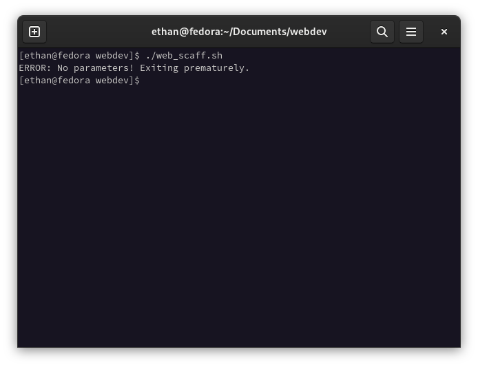
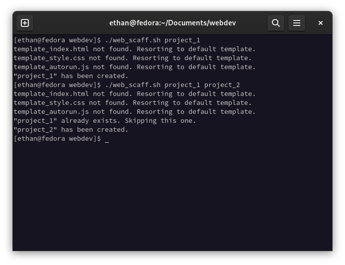
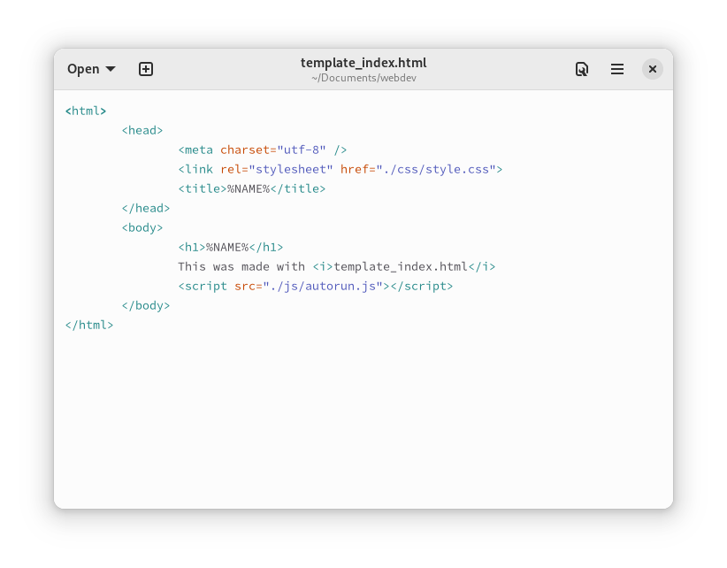

# Bash script for scaffolding HTML Boilerplate

## Table of Contents
1. [Introduction](#introduction)
2. [Requirements](#requirements)
3. [Tutorial](#tutorial)
4. [Source Code](#source-code)

## Introduction
Have you found yourself repetitively creating the same folder and file structures each time you want to make a website? Don't you wish there was a 37-line Bash script called *web-scaff.sh* that *only* takes up 1.2kB? Well, do we have the solution for you!

## Requirements
### General
1. [Bash Shell](https://www.gnu.org/software/bash/)
2. [GNU coreutils](https://www.gnu.org/software/coreutils/) or alternative

### Windows Users
1. [Windows Subsystem for Linux (WSL)](https://learn.microsoft.com/en-us/windows/wsl/install)

## Tutorial
For this tutorial, you will need to make sure you have the required software before you proceed.

### Installing the Windows Subsystem for Linux
For Windows users, the WSL is an easy way to run Bash scripts and use *coreutils* on windows. In order to install this, please follow [this guide](https://learn.microsoft.com/en-us/windows/wsl/install).

### Setting up the script
In order to use the script you must first download it. Copy [the text below](#source-code) into a file called *web_scaff.sh*. On \*nix systems, Bash scripts are not permitted to be executed by default. To remedy this, type the following command into your command-line:

	chmod +x web_scaff.sh

Now you are able to run the script! Move the script to the directory in which you would like to create the projects.

If you have already ran the script, you will notice that there are warnings:


The reason for this is that you have not supplied any parameters to the script. The names of the project folders that you wish to create should be listed after the command as parameters like such:

	./web_scaff.sh project_1 project_2 project_3

If you try to create a project with a name of an existing folder, you will get an error. If multiple project names were supplied, the ones that do not conflict with preexisting will still be created:


### Templates
This script supports templates! If you place specifically named files in the same directory of the script, it will use them as a template when creating the project folders. The template names are:

* *template_index.html* - template for index HTML file 
* *template_style.css* - template for default CSS file
* *template_autorun.js* - template for autorun JS file

#### Variables
Certain keywords can be used to be replaced with strings from the script. Currently, only the *NAME* variable is implemented at the moment. Variables are put between percent signs. Here is an example template:


## Source Code
*web_scaff.sh*
```
#!/bin/bash
# Defaults
INDEX="\
<html>
	<head>
		<meta charset=\"utf-8\" />
		<link rel=\"stylesheet\" href=\"./css/style.css\">
		<title>{NAME}</title>
	</head>
	<body>
		<script src=\"./js/autorun.js\"></script>
	</body>
</html>"
STYLE="\
body {
	font-family: sans-serif;
}"
AUTORUN="\
console.log(\"Hello world!\");"
# Error checking
[ $# -eq 0 ] && echo "ERROR: No parameters! Exiting prematurely." && exit 1
# Look for templates
if [ -r ./template_index.html ]; then INDEX=$(<./template_index.html)
else echo "template_index.html not found. Resorting to default template."; fi
if [ -r ./template_style.css ]; then INDEX=$(<./template_style.css)
else echo "template_style.css not found. Resorting to default template."; fi
if [ -r ./template_autorun.js ]; then INDEX=$(<./template_autorun.js)
else echo "template_autorun.js not found. Resorting to default template."; fi
# Iterate over arguments
for arg in "$@"; do
	[ -d ./$arg ] && echo "\"$arg\" already exists. Skipping this one." && continue
	mkdir $arg $arg/js $arg/css $arg/img
	echo "${INDEX//\{NAME\}/$arg}" >> $arg/index.html
	echo $STYLE >> $arg/css/style.css
	echo $AUTORUN >> $arg/js/autorun.js
	echo "\"$arg\" has been created."
done
```